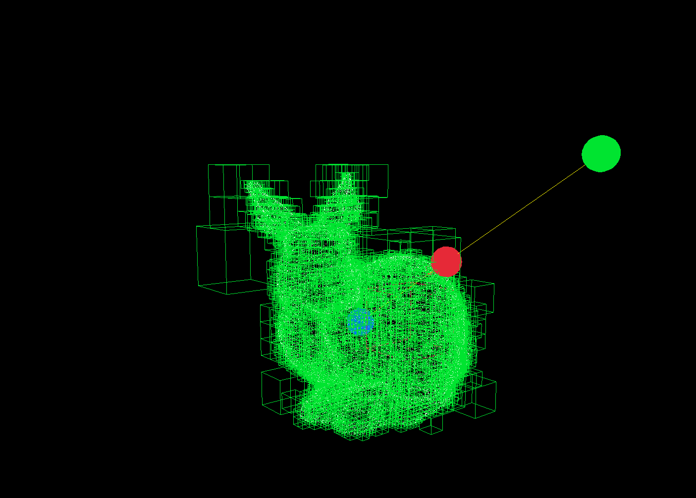

# PointOctree

A high-performance C++ library inspired by the **LidarPointCloud** plugin in Unreal Engine. This library provides efficient spatial partitioning, raycasting, and geometric operations using an octree structure, tailored for handling 3D point clouds and spatial queries.

---

---
## Features

- **Octree Data Structure**: Optimized for managing and querying large 3D point clouds.
- **Raycasting and Intersection**: Supports ray-box, ray-sphere, and ray-node intersection tests.
- **Spatial Queries**: Retrieve points or indices within a bounding sphere or box.
- **Morton Codes**: Efficient spatial hashing for organizing points in the octree.
- **Batch Processing**: Perform operations like sphere casting on multiple rays simultaneously.
- **Multithreading Support**: Leverages OpenMP for parallel processing of large datasets.

---

## Usage

### Creating an Octree

```cpp
#include "pointOctree.h"

int main() {

    std::vector<std::vector<double>> points = {
        {0.0, 0.0, 0.0},
        {1.0, 1.0, 1.0},
        {2.0, 2.0, 2.0}
    };

    // Initialize the octree with a maximum depth of 16
    pointOctree octree(16);
    octree.create(points);

    // Query points within a sphere
    std::vector<size_t> indices;
    octree.getPointIndicesIntersectingSphere({1.0, 1.0, 1.0}, 1.5, indices);

    for (size_t idx : indices) {
        std::cout << "Point index: " << idx << std::endl;
    }

    return 0;
}
```
### Sphere Cast
traces a sphere of given radius along the direction of ray. populates HitInfo with trace result.

```cpp
pLine c_ray;
c_ray.p0 = {raystart.x, raystart.y, raystart.z};
c_ray.dir = {ray.direction.x, ray.direction.y, ray.direction.z};

octree.sphereCast(c_ray, 0.01, 20, hitinfo);

// do a batch sphere cast with parallelization support using OpenMP
octree.batchSphereCast(rays, 0.01, 20, hitinfos);
```
